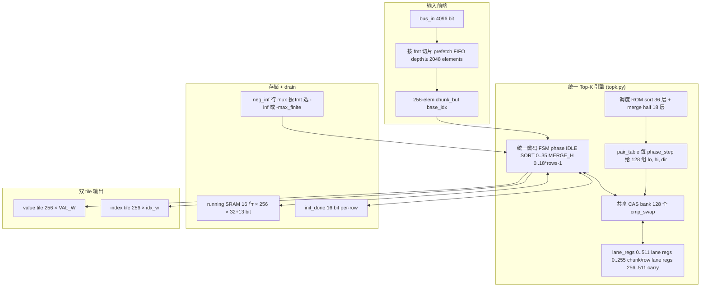
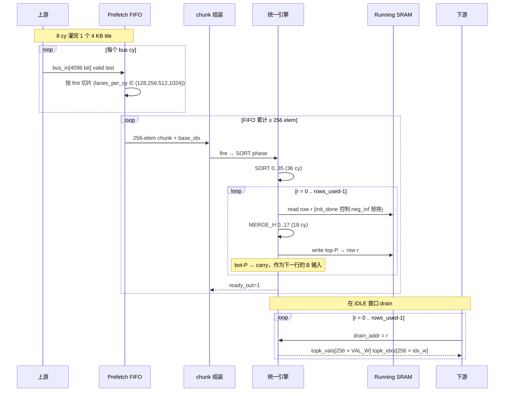

# Top-K 流式硬件 — 实现方案与时间复杂度

> 面向 GEMM / Attention 等场景的 **在线 Top-K 选取**。数据按 4 KB tile 分 8 个周期流入，硬件在同一份电路里完成 **多浮点格式（bf16 / fp16 / fp32 / fp8_e4m3 / fp4_e2m1）** 与 **运行时 K** 的 Top-K 选取，输出按 value tile + index tile 双流回写。
>
> 本版本相对前一版本（`stage_a` + `stage_b` 双文件 + 全展开 merge）做了 **架构合并**：sort 阶段与 merge 阶段共享同一个 **128 个 CAS 比较-交换单元** 的硬件 bank，全部数据通路 + FSM 合并到单一 `topk.py` 文件中。

---

## 1. 设计目标

| 维度 | 目标 |
|---|---|
| 总线宽度 | 输入 ≤ **512 B/cy = 4096 bits/cy**；一个 4 KB tile 在 8 cy 内灌完 |
| Tile 容量 | 4 KB；元素数随 fmt 变化（fp32: 1024 / fp16,bf16: 2048 / fp8: 4096 / fp4: 8192） |
| K 范围 | 运行时输入 `k_in ∈ [1, K_MAX]`，`K_MAX = 4096` |
| 排序网络 | 256-wide bitonic（每 chunk = 256 elements） |
| 比较-交换硬件 | **128 个 CAS 单元** 共享一个 bank，sort/merge 跨层、跨阶段时分复用 |
| 多 fmt | 同一份硬件运行时切换，3-bit `fmt_sel` 预留扩展位 |
| 输出 | 2 个 tile，分别承载 value 和 index，按 256-lane 行 drain |

---

## 2. 输入 / 输出 / 配置契约

### 2.1 输入

| 端口 | 宽度 | 含义 |
|---|---|---|
| `bus_in` | 4096 bit | 当前周期的元素流，按 fmt 切片（fp32: 128 lane × 32, fp16: 256×16, fp8: 512×8, fp4: 1024×4） |
| `bus_in_valid` | 1 | 当前 `bus_in` 是否有效 |
| `bus_in_last` | 1 | 当前 cycle 是该 tile 的最后一拍（tile 边界标志） |
| `fmt_sel` | 3 | 0=bf16, 1=fp16, 2=fp32, 3=fp8_e4m3, 4=fp4_e2m1（5..7 保留） |
| `k_in` | 13 | 运行时 K ∈ [1, 4096] |
| `topk_drain_addr` | 4 | 选择 K_MAX/P = 16 行中的哪一行用于输出 |

> 备份接口：保留旧版直连 256-lane `chunk_vals` / `chunk_idxs` / `valid_in`，便于现有 smoke testbench 复用。

### 2.2 输出

| 端口 | 宽度 | 含义 |
|---|---|---|
| `topk_vals` | 256 × 32 = 8192 bit | drain_addr 指定行的 256 个 value（fp32 占满，fp16/bf16/fp8/fp4 占低位） |
| `topk_idxs` | 256 × 13 = 3328 bit | 该行对应的 256 个原始 index（lane 0 在 LSB） |
| `running_valid` | 1 | 至少一个 chunk 完整 absorb 后 sticky 为 1 |
| `ready_out` | 1 | 顶层 issue throttle，0 表示当前 cycle 不能 fire |
| `phase_dbg` | small | debug：当前 phase（IDLE / SORT[i] / MERGE_H[j]） |

### 2.3 协议要点

- **复位即可用**：SRAM 通过 `init_done` per-row bit 自透明初始化，未写过的行读出来视为 `neg_inf` 或 `neg_max_finite`（取决于 fmt）。
- **背压**：`ready_out` 在 SORT + MERGE 期间为 0，上游必须遵守。
- **稳定性约束**：一个 session 内 `fmt_sel` 与 `k_in` 必须保持稳定，切换须先复位。
- **Drain**：在 IDLE 期间逐拍切换 `drain_addr ∈ [0, rows_used-1]` 把完整 Top-K 顺序读出，每拍 256 元素一行。

---

## 3. 整体架构

### 3.1 单一统一引擎

旧方案的 `stage_a.py`（sort）/ `stage_b.py`（merge）拆分被合并：sort 和 merge 现在都跑在同一个 128-CAS bank 上，共享 lane regs、共享调度器。所以只剩 **一个 FSM、一个 cas bank、一份 lane regs**。



### 3.2 单 FSM 的 phase 状态

```text
IDLE
 │  chunk_ready → 装载 lane_regs[0..255] ← chunk_buf
 ▼
SORT[0] → SORT[1] → ... → SORT[35]
 │  36 拍跑完 256-wide bitonic sort schedule（共 36 层，每层 128 pair）
 ▼
准备 merge：sort 结果 → lane_regs[256..511]（carry）；
            SRAM[0] / neg_inf → lane_regs[0..255]
 │
 ▼
MERGE_H[0] → MERGE_H[1] → ... → MERGE_H[17]    （row r = 0）
 │  18 个半层，每半层 128 pair，等价于原始 9 层 × P=256 pair 的全展开
 │
 │  rows_used > 1 时：
 │      top-P → SRAM[r]；bot-P → lane_regs[256..511]（下一次 carry）
 │      SRAM[r+1] → lane_regs[0..255]
 │      r ← r+1，回 MERGE_H[0]
 │
 ▼
回到 IDLE（top-P 已写回 SRAM[r-1]，可接收下一个 chunk）
```

### 3.3 共享 CAS bank 的工作方式

128 个 `cmp_swap_const_dir` 单元并排放，每个单元的 4 个输入端口都接一棵 **54:1 mux 树**（54 = 36 sort 层 + 18 merge 半层）。当前 `phase_step` 决定每个 cas slot 这一拍取哪两条 lane、用哪个方向。

```text
lane_regs[0..511] (val + idx)
        │
        ▼ (54:1 mux per port, 静态展开)
┌───────────────────────────────────────────────┐
│  cas[0]  cas[1] ... cas[127]                  │  ← 128 个比较-交换单元
└────────────┬──────────────────────────────────┘
             │ lo / hi 输出
             ▼ (demux 写回)
lane_regs[0..511]
```

* `dir`（升 / 降）在调度展开时已经是 Python int 常量，所以用 `cmp_swap_const_dir`（省一层 XOR）。
* `pair_table_rom` 不是真正的 ROM —— 它是 Python 静态展开后的 mux 选项表，编译期就刻进硬件，无运行时存储。

---

## 4. 排序 / 合并调度

### 4.1 Sort phase（256-wide bitonic sort）

- Schedule：`gen_sort_schedule_desc(256)` —— Batcher Bitonic，`log2(256) · (log2(256)+1) / 2 = 8 · 9 / 2 = 36` 层。
- 每层 `256 / 2 = 128` 个 pair。
- 128 个 pair × 36 层 = **36 cy / sort**，全程 bank 满载。

### 4.2 Merge phase（2P=512 bitonic merge，半层切分）

- 原始 schedule：`gen_full_merge_2p_desc(256)` —— `log2(256) + 1 = 9` 层，每层 `2P / 2 = 256` 个 pair。
- 由于 bank 只有 128 cas，把每层的 256 pair 切成 **lo half + hi half**，每半 128 pair。
- 新 schedule：`gen_merge_half_schedule_2p(256)` 返回 `2 × 9 = 18` 个半层。
- 18 cy / merge，全程 bank 满载。

> Half-split 正确性来自一个关键观察：每个 layer 内 256 个 pair 的 index 互不相交，所以无论先做 lo 128 pair 还是 hi 128 pair，结果完全一致——可以安全切成两个半层。selftest `test_bitonic_schedule.py` 中会用 `apply_schedule` 对 `gen_merge_half_schedule_2p` 和 `gen_full_merge_2p_desc` 做等价校验。

### 4.3 Phase 步进汇总

| Phase | 步数 | 每步 cas 利用 | 单次任务总 cy |
|---|---|---|---|
| SORT[0..35] | 36 | 128 / 128 | 36 cy / chunk |
| MERGE_H[0..17] | 18 | 128 / 128 | 18 cy / row |
| 每 chunk 总和 | — | — | `36 + 18 · rows_used` |

`rows_used = ceil(k_in / 256)`，所以：

| K | rows_used | 每 chunk cy |
|---|---|---|
| K ≤ 256 | 1 | 36 + 18 = **54** |
| 257 ≤ K ≤ 512 | 2 | 36 + 36 = **72** |
| 1024 | 4 | 36 + 72 = **108** |
| 2048 | 8 | 36 + 144 = **180** |
| 4096 | 16 | 36 + 288 = **324** |

---

## 5. 浮点比较器（5 fmt 并联 + 3-bit fmt_sel）

`fp_lt(a32, b32, fmt_sel)` 在内部并联 5 条 monotone-key 转换路径：

```text
            ┌─ key_bf16 ─┐
            ├─ key_fp16 ─┤
a32, b32 ───┼─ key_fp32 ─┼─ unsigned cmp ─┐
            ├─ key_fp8e4m3┤                │ 5-to-1 mux ← fmt_sel
            └─ key_fp4e2m1┘                │
                                          ▼
                                          lt
```

各 fmt 的关键属性：

| fmt | width | exp/man | has_inf | has_nan | NaN/sentinel 处理 |
|---|---|---|---|---|---|
| bf16 | 16 | 8/7 | yes | yes | NaN → -inf（IEEE） |
| fp16 | 16 | 5/10 | yes | yes | NaN → -inf（IEEE） |
| fp32 | 32 | 8/23 | yes | yes | NaN → -inf（IEEE） |
| fp8 E4M3 | 8 | 4/3 | **no** | yes (S.1111.111) | NaN → neg_max_finite（OCP FP8） |
| fp4 E2M1 | 4 | 2/1 | **no** | **no** | sentinel = neg_max_finite（MXFP4） |

> `neg_inf` 在 fp8_e4m3 / fp4_e2m1 不存在 —— sort 网络在「未写过的 SRAM 行」处需要的「极小值哨兵」改用各 fmt 的最负有限值（neg_max_finite），保持比较器的严格单调性。

---

## 6. 数据流：从 bus_in 到 双 tile 输出



`index` 由 cycle 计数 + lane offset 在前端自动产生（`base_idx = chunk_id × 256 + lane_id`），不需要上游 chunk_idxs 总线宽度去承载 `≥ 13 bit/lane`。

---

## 7. 时间复杂度

### 7.1 渐近分析（数学）

记输入元素个数 `N`，请求 Top-K = `K`，硬件 chunk 宽度 `P = 256`。`n_chunks = ⌈N / P⌉`，`rows_used = ⌈K / P⌉`。

**Sort phase 复杂度**：每个 chunk 跑 36 层 × 128 pair = 4608 比较-交换，渐近为 `O(P · log² P) = O(256 · 64) = O(16 K)` 比较-交换/chunk。

**Merge phase 复杂度**：每个 chunk 跑 `rows_used × 9 × 2P = rows_used × 4608` 比较-交换 = `O(rows_used · P · log P)`。

**全引擎单 chunk 比较-交换次数**：

```
W_chunk = P/2 · log P(log P + 1) / 2     ← sort
        + rows_used · P · (log P + 1)    ← merge
        = O(P · log² P) + O(K · log P)
```

代入 P=256：

```
W_chunk = 4608 + rows_used · 2304
       = 4608 + ⌈K/256⌉ · 2304
```

**全任务总比较-交换次数**：

```
W_total = n_chunks · W_chunk
        = ⌈N/256⌉ · (4608 + ⌈K/256⌉ · 2304)
        = O(N · log² P) + O(N · K · log P / P)
```

当 `K = O(P)` 时，主导项是 `O(N · log² P)`；当 `K ≫ P`（如 K=4096, P=256, K/P=16）时，merge 项占主导：`O(N · K · log P / P)`。

### 7.2 周期复杂度（硬件实际节拍）

由于 128 个 CAS bank 满载，每拍处理 128 比较-交换：

```
T_chunk = ⌈W_chunk / 128⌉ = 36 + rows_used · 18  cy
T_total = n_chunks · T_chunk  +  pipeline_drain (≤ 18 cy)
        = ⌈N/256⌉ · (36 + ⌈K/256⌉ · 18) + O(1)
```

代表性数字（per 4 KB tile，N 按 fmt 取上限）：

| fmt | N | n_chunks | K=256 (rows=1, 54 cy/ch) | K=1024 (rows=4, 108) | K=4096 (rows=16, 324) |
|---|---|---|---|---|---|
| fp32       | 1024 | 4  | 216 cy   | 432 cy   | 1 296 cy  |
| fp16/bf16  | 2048 | 8  | 432 cy   | 864 cy   | 2 592 cy  |
| fp8 E4M3   | 4096 | 16 | 864 cy   | 1 728 cy | 5 184 cy  |
| fp4 E2M1   | 8192 | 32 | 1 728 cy | 3 456 cy | 10 368 cy |

> 数据全部送到位需要 8 cy（4 KB / 512 B/cy），相对计算 cy 可以忽略；当 chunk 计算时间远大于 bus 周期时，prefetch FIFO 不会爆—— FIFO 深度 ≥ 2048 元素即可吸收 fp4 一个 tile 的全部输入（1024 elem/cy × 8 cy = 8192 elem，分 32 chunks，每 chunk 后 fifo 退 256 元素，最坏 occupancy = 8192 - 256 = 7936 元素，所以更准确地说 FIFO 容量按 8192 算）。
>
> > 修订：为了安全把 FIFO 容量按 **8192 元素（= 1 fp4 tile）** 设计，避免上游必须等待引擎跑完 chunk。

### 7.3 与传统软件 Top-K 的渐近对比

| 方案 | 时间复杂度（比较次数） | 备注 |
|---|---|---|
| 全排序 quicksort `O(N log N)` | `O(N log N)` | 不流式、不分批 |
| Heap-based Top-K `O(N log K)` | `O(N log K)` | 流式但串行 |
| **本方案（流式 bitonic）** | **`O(N log² P + N K log P / P)`** | **流式 + 并行 128**，每 cy 处理 128 比较 |
| 全并行 bitonic (fully unrolled) | 同样比较次数 | 但需 `O(P log² P)` = 4608 cas（前一版 Stage A）+ `O(P log P)` = 2304 cas（前一版 Stage B），总 ~7K cas，9× 面积 |

结论：**牺牲一定的 wall-clock 时间（每 chunk 从 1 cy 增加到 36 + 18·rows_used cy）换取 9× 比较-交换硬件数量减少**（从 ~7 K cas 降到 128 cas）。

### 7.4 关键路径（组合深度）

| 段 | 主组合深度 |
|---|---|
| lane_regs → cas mux tree (54:1) | `⌈log2 54⌉ = 6` 层 mux |
| cas 内部：`fp_lt` 5-路并联 + 5:1 mux | NaN-fold + sign-flip + unsigned cmp + 5:1 mux ≈ 8–10 gate-equivalent layers |
| cas 内部：swap mux | 2 层 mux |
| cas → lane_regs demux + 写回 | 1 层 mux |
| **合计单 cycle** | 约 18–20 gate-equivalent layers |

若 STA 在 mux 树深度上吃紧，**回退方案**：把单一 bank 拆成两个独立的 128-cas bank（一个专做 sort、一个专做 merge），mux 树就从 54:1 缩到 36:1 / 18:1，组合深度各降 1 层 mux。两 bank 总数仍是 256 cas，比上一版 7 K cas 节省 27×。这条回退不需要重新拆 stage_a/stage_b 文件 —— 仍然在单一 `topk.py` 内部完成。

---

## 8. 资源 / 面积估算（P=256, K_MAX=4096, idx_w=13）

| 项目 | 数量 |
|---|---|
| 共享 CAS bank | **128** 个 cmp_swap_const_dir |
| sort schedule pair 表（编译期） | 36 × 128 = 4608 项 |
| merge half-layer pair 表（编译期） | 18 × 128 = 2304 项 |
| `fp_lt` 内部 monotone-key 并联 | 5 路（bf16 / fp16 / fp32 / fp8 / fp4） |
| lane registers | 512 lane × (32 + 13) = 23 040 bit |
| Running SRAM | 16 行 × 256 lane × 45 bit ≈ **184 320 bit ≈ 23 KB** |
| `init_done` FF | 16 |
| Prefetch FIFO | 8192 elements × (val_w_max=32 + base_idx_local 8) ≈ 320 Kbit（深 SRAM-like buffer） |
| Drain buffer | 256 × 45 = 11 520 bit（按 fmt 还可再压缩） |
| 顶层 fmt_sel 端口 | 3 bit |
| `k_in` 端口 | 13 bit |
| `drain_addr` 端口 | 4 bit |

相比上一版（Stage A 4608 cas + Stage B 2304 cas = **6912 cas**），新方案 cas 数降到 **128**，节省 **54×**；额外代价是 cas 端口的 54:1 输入 mux 树 + 18+36-phase FSM ROM。

---

## 9. 文件结构（合并后）

```
designs/examples/topk/
├── topk.py                    ← 单一大文件：FSM + cas bank + lane regs + SRAM + FIFO + drain + build()
├── topk_config.py             ← FpFormat 表（含 fp8/fp4）、fmt_sel 编码、bus/tile 常量
├── fp_compare.py              ← fp_lt：5 路 monotone-key + 3-bit fmt_sel
├── cmp_swap.py                ← cas 原子单元（cmp_swap_const_dir）
├── bitonic_schedule.py        ← gen_sort_schedule_desc / gen_full_merge_2p_desc / gen_merge_half_schedule_2p + 软件参考
├── tool.py                    ← float ↔ bits（含 fp8/fp4）、key 转换、special values
├── tb_topk.py                 ← smoke tb + --algo 矩阵
├── tb_topk_large_lib.py       ← 大规模 tb 参数化驱动
├── tb_topk_large_{bf16,fp16,fp32,fp8_e4m3,fp4_e2m1}.py
├── run_tb_python.py
├── selftest/
│   ├── test_fp_compare.py
│   ├── test_bitonic_schedule.py
│   ├── test_topk_engine.py    ← 新：Python 复现统一引擎调度器
│   └── test_all.py
└── figures/                   ← 架构图（按本文新图重画）
```

已 **删除**：`stage_a.py` / `stage_b.py` / `local_sort.py` / `merge_cell.py`（这些功能合并进 `topk.py`）。

---

## 10. 验证方法

### 10.1 三层 self-check

1. **Schedule self-check**（`selftest/test_bitonic_schedule.py`）
   - Batcher sort schedule 输出与 `sorted(reverse=True)` 完全一致；
   - `gen_merge_half_schedule_2p` 输出与 `gen_full_merge_2p_desc` 等价（按层套用 `apply_schedule` 后结果一致）。

2. **FP 比较器 self-check**（`selftest/test_fp_compare.py`）
   - bf16 / fp16 / fp32 / fp8_e4m3 / fp4_e2m1 各跑 1 000+ 随机；
   - fp4_e2m1 全 16 × 16 枚举；
   - 所有 NaN / ±0 / ±inf / subnormal 边界覆盖。

3. **统一引擎 self-check**（`selftest/test_topk_engine.py`）
   - Python 软件调度器（与 RTL 同步 export）跑 sort phase → 与全展开 `apply_schedule` bit-exact；
   - 跑 merge phase → 与 `apply_schedule(gen_full_merge_2p_desc)` bit-exact；
   - 端到端 N 元素 → 与 `golden_topk_keys` 一致。

### 10.2 RTL 仿真

- **Smoke tb**（5 个 fmt，P=4, K_MAX=16, K=4）：每 fmt 喂 2 个 chunk，对照 `sw_topk_unified_pairs` 软模型 cycle-accurate 验证。
- **Large tb**（5 个 fmt，P=256, K_MAX=4096，K ∈ {64, 1024, 4096}）：每 fmt 一份独立 Verilator 二进制，喂 8 cy × n_chunks 个 chunk，按 row 0..rows_used-1 全部 drain 验证。
- **`--algo` 矩阵**：5 fmt × 7 个 K × 5 个 N 全软件 grid，附加 fp8/fp4 边界（all_nan、all_neg_max_finite、fp4 dense exhaustive）。

---

## 11. 关键设计权衡

| 选择 | 优势 | 代价 |
|---|---|---|
| **单一 128-cas bank**（sort + merge 共享） | cas 数从 6912 降到 128（-54×）；硬件统一，只有一个 FSM | 每 chunk 周期数从 1 cy 增至 54..324 cy；54:1 mux 树吃掉一些组合深度 |
| **单文件 `topk.py`** | 调度 / FSM / 数据通路集中可读；不再有 stage 间接口 | 文件偏大（~1.5–2 K 行），需要靠 Section 注释分段 |
| **多 fmt 运行时切换** | 一份硅多用，覆盖 bf16/fp16/fp32/fp8/fp4 | `fp_lt` 5 路并联，每个 cas cell 比较器面积约 +60% |
| **Prefetch FIFO + 自动 idx** | 上游不必关心 fmt 与 chunk 边界；总线宽度固定 4096 bit | 引入约 8192-elem 的 FIFO 缓存（约 320 Kbit） |
| **半层 merge 切分** | merge 与 sort 共享同一 128 cas bank | merge 周期数从 9 cy 升到 18 cy |
| **3-bit fmt_sel 预留** | 未来可加 fp8_e5m2、fp4_hifp4 等 | 表面冗余位 |

---

## 12. 一句话总结

> 在同一份 `topk.py` 文件、同一个 128 个 CAS 单元构成的共享 bank 上，按 phase 串行跑 **36 拍 sort + 18 拍/row × rows_used 拍 merge**，把每个 4 KB tile 在 `⌈N/256⌉ · (36 + 18 · ⌈K/256⌉)` 个 cycle 内完成 Top-K 选取；硬件渐近时间复杂度 `O(N · log² P + N · K · log P / P)`，cas 数从前一版的 6912 降到 128（节省 54×），运行时支持 bf16/fp16/fp32/fp8_e4m3/fp4_e2m1 五种 FP 格式。
