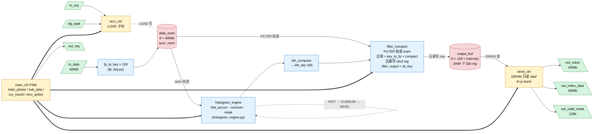
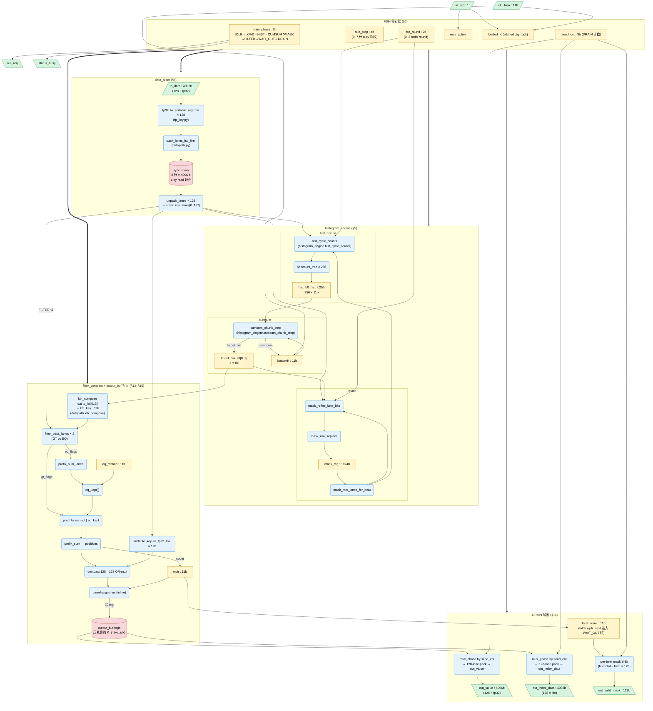

# Top-K Histogram 加速器

基于 4 轮 8-bit Radix-Select 的 fp32 Top-K 硬件实现，pyCircuit DSL 写就。

- 完整算法与时序细节：见 [`arch.md`](./arch.md)
- 实现入口（顶层 `@module build`）：[`topk_histogram.py`](./topk_histogram.py)
- 软件黄金参考：[`topk_histogram_model.py`](./topk_histogram_model.py)

---

## 1. 模块布局

| 文件 | 角色 | 含状态？ |
|---|---|---|
| `topk_histogram.py` | **顶层 `@module build`**：所有寄存器/SRAM/FSM 都在这里分配 | 是（唯一含状态点） |
| `topk_histogram_config.py` | `DEFAULT_PARAMS` 与 `validate_params()`、smoke/nightly 预设 | 否（纯常量） |
| `fp_key.py` | `fp32_to_sortable_key_hw` / `sortable_key_to_fp32_hw`（软硬件共用同一份位级规则） | 否 |
| `datapath.py` | `unpack/pack_lanes_lsb_first` / `mux_phase` / `kth_compose` | 否 |
| `histogram_engine.py` | **`histogram_engine`**：`hist_accum` / `cumsum` / `mask` 三个子模块的组合 helper | 否 |
| `histogram.py` | 兼容 re-export（新代码请用 `histogram_engine`） | 否 |
| `filter_output.py` | `filter_pass_lanes` / `prefix_sum_lanes` | 否 |
| `topk_histogram_model.py` | Layer A 软件模型 `simulate_histogram_python` + `_selftest` | 否 |
| `tool.py` | fp32 位级辅助 + 随机数据生成 | 否 |
| `tb/` | `@testbench` 描述（smoke/nightly）+ Layer C Python 重放 | — |

> **重要前提**：在 pyCircuit 的语义里，topk-histogram 是 **单一 `@module build`** —— 不存在 `m.instance(...)` 之类的层次化子模块实例化。`datapath.py` / `histogram_engine.py` / `filter_output.py` 里的函数都是**纯组合 Python 辅助**，被 `topk_histogram.py:build()` 直接调用展开（inline）到同一个 MLIR `func.func` 里。下面图里的"子模块"指的是**逻辑功能块**，不是 RTL 实例。

---

## 2. 硬件实现总览

### 2.1 第一级（顶层功能块视图）

只画顶层功能块 + 控制 FSM + 顶层 I/O 之间的数据/控制流，看整体形状用。粗线 `===>` 是 FSM 的控制扇出；虚线回边是 **`histogram_engine` 内部 HIST → CUMSUM → MASK** 的 radix 迭代。**没有 `data_sram` → `output_buf` 存储直连**：FILTER 拍读 SRAM、经组合逻辑压紧后写 `output_buf` 寄存器；DRAIN 只读 `output_buf`。



数据通路一句话总结：`in_data` → `data_sram` → **`histogram_engine`**（四轮 radix）→ `kth_key` → **FILTER 读 `data_sram` 并压紧写入 `output_buf`** → **DRAIN 只读 `output_buf`** 8-cy burst 输出。

### 2.2 第二级（详细视图，含全部 helper、寄存器与 mux）

方块 = 时序/存储元件或一组寄存器，圆角框 = 纯组合逻辑块（括号里写它来自哪个 helper），箭头 = 关键信号流，粗线 `===>` = FSM 控制信号扇出。`unpack1`（`sram_rdata`）在 FILTER 阶段只作为**读口扇出**进入谓词与 `key_to_fp`，再经 `compact` 写入 `obuf`；**不存在绕过 FILTER 的 `data_sram → output_buf` 连线**。



**配色含义**

- **绿** = 顶层 I/O 端口
- **黄** = 寄存器 / 寄存器组（FSM、累加器、latch、指针）
- **红** = 大块存储（`sync_mem` SRAM 与 `output_buf` 寄存器阵列）
- **蓝** = 纯组合逻辑块（括号里写了它来自哪个 helper）
- 粗线 `===>` = FSM 控制信号（`main_phase` / `sub_step` / `cur_round` / `recv_active` 等同时驱动多个块）

---

## 3. "子模块" 的真实物理统计

| 类别 | 数量 / 容量 | 实现位置 |
|---|---|---|
| `sync_mem` SRAM | 1 个：`data_sram` 8 × 4096b | `topk_histogram.py:193` |
| 寄存器组 | `hist_b0..hist_b255` (256 × 11b)、`target_bin_lat[0..3]` (4 × 8b)、`mask_reg` (1024b)、`out_buf_val/idx` (8×128×2 = **2048** × 32b)、`wptr`/`eq_remain`/`bottomK`/`loaded_K`/`total_count` (各 1 × 11b)、`main_phase`/`sub_step`/`cur_round`/`recv_active`/`send_cnt` (FSM 状态) | `topk_histogram.py` 全文 |
| 128 路并行组合逻辑 | fp32↔key 转换、filter_pass、compact 128 候选 OR、barrel rotate 128 候选 mux | helpers (`fp_key.py` / `datapath.py` / `filter_output.py`) |
| 256 路并行组合逻辑 | `histogram_engine`：`hist_accum` + `cumsum` + `mask` | `histogram_engine.py` |
| 控制 FSM | 1 个主 FSM (`main_phase`) + 2 个子计数器 (`sub_step` / `send_cnt`) + radix 计数 (`cur_round`) + 4 个跨阶段 latch | `topk_histogram.py:625-703` |

---

## 4. 块间 I/O 的组织方式

因为没有 instance，**所有"接口"都是同一个 `build()` 作用域里的 Python 变量**（`Wire` 对象引用）。具体连法可以归为四类：

1. **端口 → SRAM 写**：`in_data → unpack_lanes → fp32_to_sortable_key_hw × 128 → pack_lanes_lsb_first → sram.wdata`；`waddr = sub_step_lo`，`wvalid = recv_active & in_load`。
2. **SRAM 读 → 多消费者（同一读口、不同相位）**：`sram_rdata → unpack_lanes → sram_key_lanes` 在 **radix 拍**馈入 `histogram_engine`；在 **FILTER 拍**馈入谓词比较 + `key_to_fp`，再经 `compact/barrel` **写入** `output_buf`——**没有**第三路直连 `output_buf`。
3. **跨阶段 latch**：`target_bin_lat[r]` 在 round r 的 CUMSUM **末 chunk 拍**写入，后续阶段读出。`eq_remain` 在最后一个 CUMSUM 末 chunk 拍 latch（`cum_hist_at_target` + `bottomK_dec`），FILTER 阶段每拍按 `eq_taken_this_cy` 减。
4. **FSM "总线"**：`main_phase`/`sub_step`/`cur_round` 由 FSM 一个寄存器集中产出，再以**条件信号 + ternary**的形式分发给各 phase mux（`scanning_phase`、`in_hist`、`in_cum`、`in_filter`、`load_start`、`is_last_round`、`at_beat_last` 等都是从这几个寄存器派生出来的）。

### 一处特别值得注意的接口约定

SRAM 是 **1 周期读延迟**（`sync_mem`），所以 `raddr` 在 scanning phase 比"本拍要消费的 beat"领先一拍：

```190:190:designs/topk-histogram/topk_histogram.py
    raddr = raddr_inc if scanning_phase else m.const(0, width=ADDR_W)
```

与之对应，`mask_row` 的索引用的不是 `raddr`，而是 `sub_step_lo`，因为 mask 选的是"本拍 `sram_rdata` 对应的 beat"，不是"下一拍"。所有"和 SRAM 同步消费"的下游块（HIST hit gating、FILTER 的 lane key、output_buf 写入的 lane_fp32）都必须按 `sub_step_lo` 而不是 `raddr` 对齐。

---

## 5. 快速验证

### 特殊值（NaN / ±Inf / ±0 / subnormal）测试覆盖

| 层级 | 是否覆盖 NaN/Inf 等 | 说明 |
|---|---|---|
| `tool.py` / `fp_key.py` selftest | 是 | 穷举 `fp32_special_values()`、NaN 往返「仍是 NaN」、±Inf 排序 |
| `topk_histogram_model.py` selftest | 是 | 全 NaN、NaN 胜过 +Inf、全 ±Inf、±0、每个 special 作 K=1 等（`_test_special_fp32_values`） |
| `gen_random_fp32` | 部分 | `include_specials=True` 时在流头部注入 canonical corners |
| `tb` smoke / nightly + Layer C | **否** | 固定常数 3.5，只验时序/打包/掩码，**不**验特殊浮点语义 |

若要验 RTL 上的 NaN/Inf，需另加专用 testbench 或改 stimulus；算法正确性以 Layer A 为准。

```bash
# Layer A — 纯 Python 模型自检（含 eq_keep 公式 + NaN/Inf 特殊值）
cd designs/topk-histogram
python tool.py && python fp_key.py && python topk_histogram_model.py

# MLIR 发射（顶层 @module build → ~35 MB MLIR）
PYTHONPATH=compiler/frontend:designs/topk-histogram \
    python designs/topk-histogram/topk_histogram.py

# Layer C — @testbench 重放（smoke + nightly，共 66 个检查点）
PYTHONPATH=compiler/frontend \
    python designs/topk-histogram/tb/run_tb_python.py
```

预期：Layer A `OK` × 4、MLIR 长度 ≈ 3.5e7 chars、Layer C `Total: pass=66 fail=0`。

更详细的分层测试说明见 [`arch.md` §9](./arch.md)。
